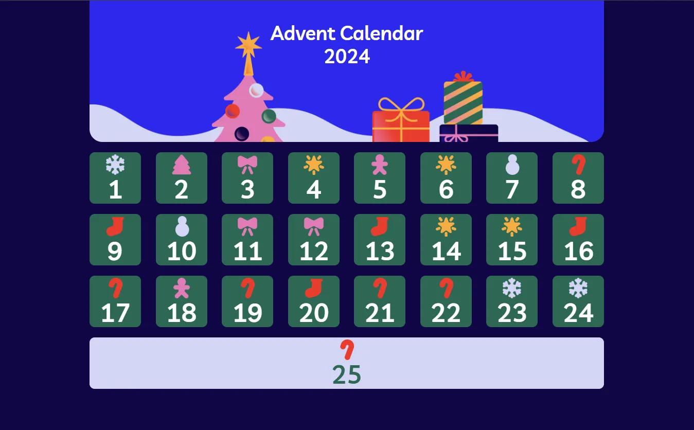

# ADVENT OF CALENDAR 
Questa repo prevede la realizzazione di un calendario dell'avvento a tema natalizio per tenersi in allenamento sotto le feste.
Questo esercizio fa parte della serie di esercizi proposti da Boolean durante il post corso.

## Indice
1. [considerazioni_pre-progetto](#considerazioni-pre-progetto)
2. [consegna](#consegna)
3. [milestone](#milestone)

## considerazioni pre progetto 
l'esercizio prevede la realizzazione del calendario esclusivamente in html css e javascript, con l'intento di allenarsi sulla programmazione di javascript plain.

Per prima cosa, vado a prepararmi i materiali del progetto e mi pianifico il lavoro da fare per essere più efficiente.
nell'immagine possiamo individuare a livello statico due macrostrutture: una per l'immagine di copertina e la parte di calendario  con il 25 che prende tutta la fila finale.
Per il calendario vado a strutturarlo su quattro  file con tre  file da otto numeri e l'ultima con il numero finale(nella versione responsive da cellulare probabilmente , le file non saranno da otto ma probabilmente saranno da quattro o inferiori).
Nella consegna c'è scritto di generare dinamicamente le caselle quindi verrà attuato un ciclo per renderizzare a schermo le caselle della pagina. 
Una volta effettuata la realizzazione statica della pagina posso pensare all'implementazione della modale, che avverrà al clic della casella del calendario e ipoteticamente andrà a cambiare il display del modale che apparirà in pagina per visualizzare il contenuto della casella.   

## Consegna 👈🏻

Creiamo il nostro **calendario dell’avvento** utilizzando HTML, CSS  e JS!

- Iniziamo col renderizzare in pagina le caselle del calendario, come mostrato nello screenshot, avendo cura di generare dinamicamente le caselle 📅
- 🧑🏻‍💻 Al click su ogni casella, dovremo far comparire una piccola modale a centro pagina e coprire lo sfondo con un overlay
- All’interno della modale mostreremo casualmente una frase o un’immagine tra quelle fornite nell’array di dati in allegato ( anche lle immagini sono in allegato) 🖼️
- 🪟 Una volta cliccata, una casella deve cambiare stile, apparendo appunto già “aperta”.
- Quando l’utente ricarica la pagina, questa deve ricordare quali caselle sono state già aperte 🎁

### Note 🗒️

- il font utilizzato è ***Livvic***

### Bonus 💫

- Il calendario deve essere **responsive**
- Aggiungiamo anche un bottone per “**resettare**” la memoria della pagina e ricominciare da capo

### milestone 

nel renderizzare le caselle del calendario, dovrò prima creare il prototipo della casella, salvarla in una variabile javascript(dentro ad un ciclo) ed eseguire un ciclo che vada a creare in pagina le caselle.
La variabile sarà salvata in una stringa con backtick per fare in modo di inserire codice html e inserire i segnaposto per l'icona, il numero ed il contenuto della modale.
Per seguire ciò ho bisogno della dimensione del container delle caselle del calendario per poter calcolare le dimensioni della cartella(una cartella dovrebbe prendere 1/8 di spazio in larghezza e 1/3 in altezza).
Il Ciclo verrà eseguito sul conto delle caselle quindi eseguo un for of sull'array fornito dall'esercizio salvato nel file [source.js](./JS/source.js)
Il for of viene dichiarato con l'indice per poter stampare in modo sequenziale il numero della casella.

Lavori da fare per domani:
creazione container caselle fatto
creazione prototipo casella con segnaposti fatto
creazione ciclo per caselle fatto

inserito font 

da fare :
cambiare stile alla casella 25 che prenda tutta la riga (dovrebbe bastare cambiare la larghezza al 100%)
idealmente, porre condizione nel ciclo : se l'indice è uguale a 25%, aggiungere stile lunghezza (non sostituisco la larghezza della classe perchè sennò cambierebbe a tutti) fatto

creare modale e creare anche event listener per modale 
creare hover per pucciosizzarlo
